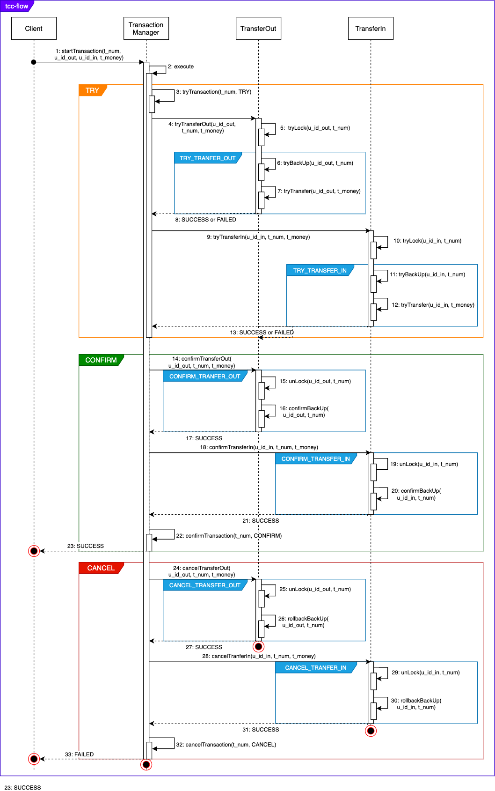

## 分布式事务实战

### 命令行参数参考

* 单独运行一个module: ```./mvnw spring-boot:run -pl {module name}```，可以参考https://stackoverflow.com/questions/1114026/maven-modules-building-a-single-specific-module
* 配置mycat容器步骤，关于mycat的配置详情可以参考https://github.com/MyCATApache/Mycat-Server，https://github.com/dekuan/docker.mycat， https://www.jianshu.com/p/f81422b1c915
    * 首先进入 ```./zip-docker/mycat```，允许命令 ```docker-compose build```，在本地建立image
    * 其次运行 ```docker image ls``` 找到对应的mycat docker image
    * 最后在 ```./zip-docker/docker-compose.yml``` 中配置mycat service
    * ```docker-compose up mysql, docker-compose up -d```启动时请注意，必须先启动mysql服务，并且创建对应的数据库和表，然后在启动mycat，否则mycat会启动失败

### 实战细节设计

#### 业务范围

* 支付功能,支持多种形式的组合付款
* 交易记录功能,支付之前,必须先生成交易记录

#### 服务划分

* 交易服务，生成交易信息，事务发起方，依赖转账服务、红包服务、积分服务（交易记录数据库）
* 转账服务，对用户账户扣款或加钱（用户账户数据库x2）
* 红包服务，扣除用户红包（红包数据库）
* 积分服务，扣除积分（积分数据库）

#### 性能测试、压力测试: 待定

#### 技术栈: dubbo，etcd，mycat，mysql，springboot，rocketmq、kafka，fascar，docker

-----------

### MVPs

#### MVP1-TCC实战

* Tasking：

> 完成交易中心，能够正常记录交易信息，处理交易信息
> 完成转账转出服务，转账转入服务，能支持分片数据库处理
> 总结TCC模式的实践

* TCC流程设计如下图所示，详细信息可以参考：https://cqupt-gsy.github.io/2020/02/TCC.html



#### MVP2-MQ实战

> 集成MQ,服务间通过异步调用
> 添加红包服务
> 添加积分服务
> 性能测试、压力测试
> 总结异步调用之间的事务处理问题

#### MVP3

* 集成fascar,其余与MVP2一样
* 总结fascar的优缺点

#### MVP4

* 设计并实现一个分布式事务框架(optional),并且与之集成
